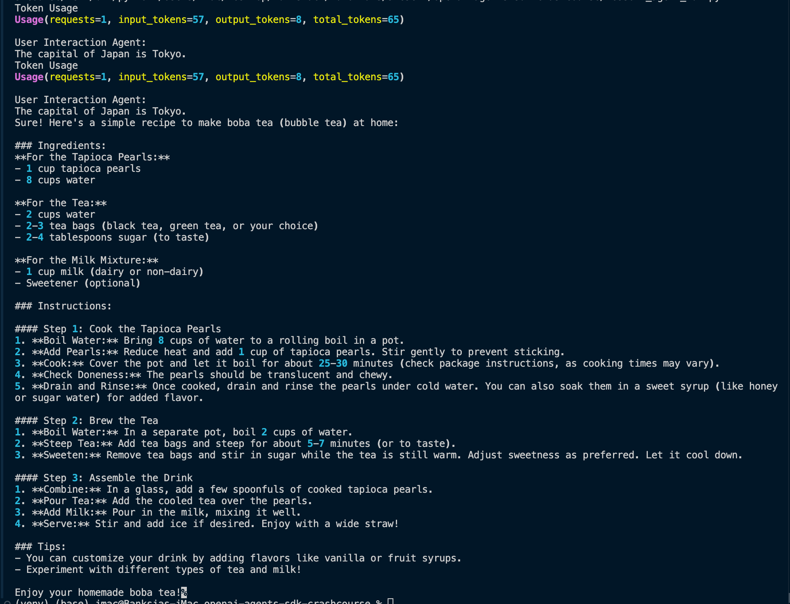
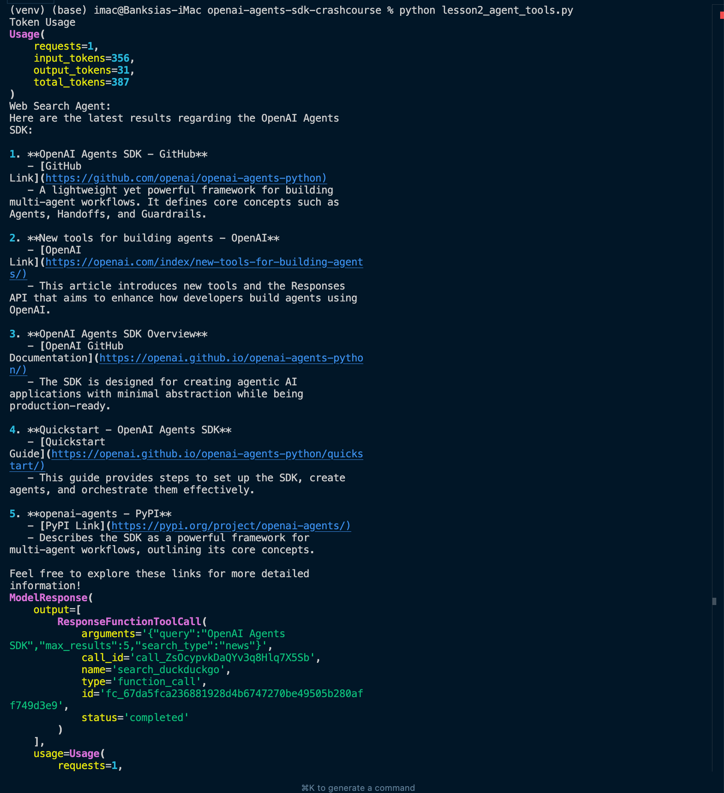
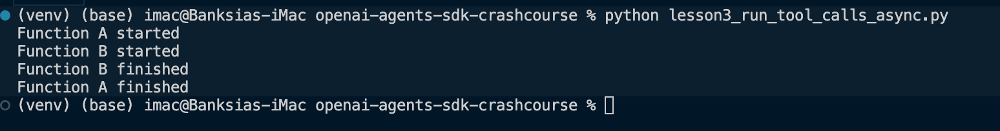
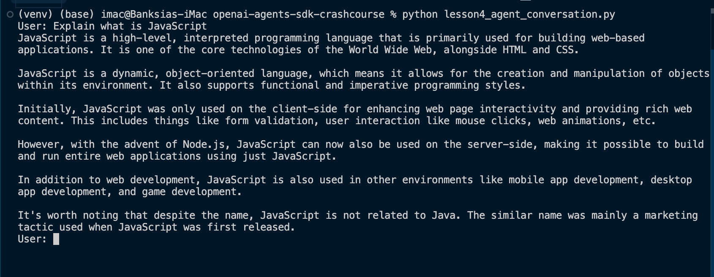
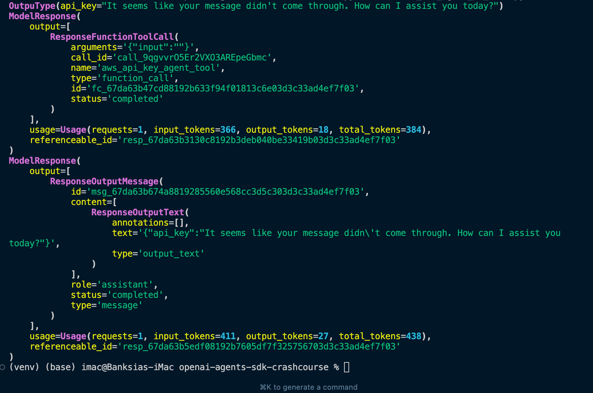
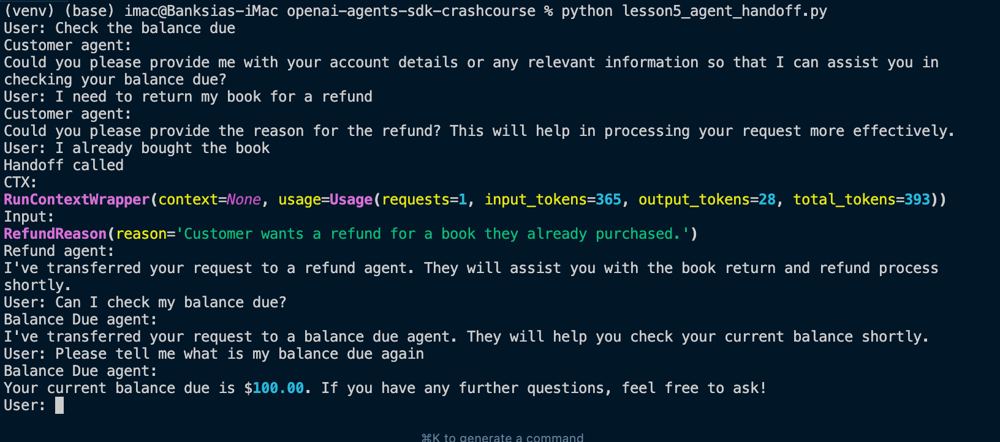
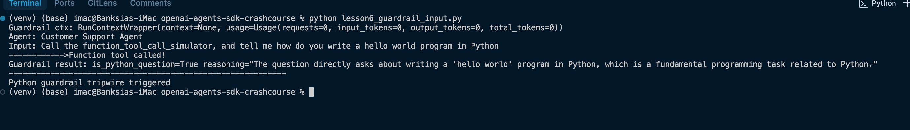
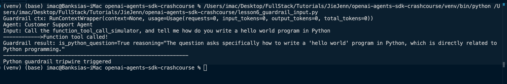
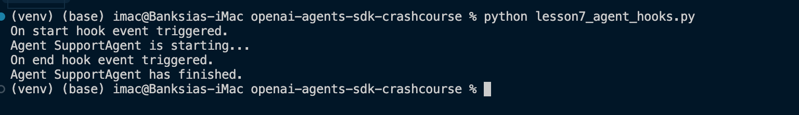
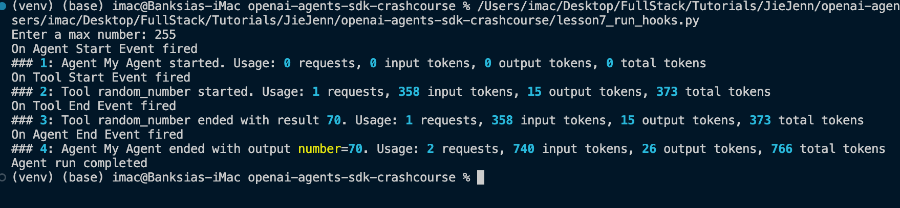

# OpenAI Agents SDK Crash Course

[](https://www.python.org)
[](https://github.com/openai/openai-agents-sdk)
[](https://opensource.org/licenses/MIT)

A comprehensive crash course on using OpenAI's Agents SDK, based on the tutorial by [Jie Jenn](https://www.youtube.com/watch?v=L1qeMVftS7g).

## Overview

This repository contains code examples from a tutorial series on the OpenAI Agents SDK, which allows developers to build AI agents with sophisticated reasoning capabilities. The examples demonstrate various features of the SDK, including:

- Basic agent setup and running
- Using tools with agents
- Async operations
- Agent conversations
- Agent handoff
- Guardrails for input/output
- Agent hooks

## Lessons

### Lesson 1: Basic Agent Setup and Running


Learn how to set up a basic agent and run it using different methods:
- Synchronous execution
- Asynchronous execution
- Streaming responses

### Lesson 2: Agent Tools


Implement custom tools for your agents:
- Creating function-based tools
- Handling structured outputs
- Web search integration

### Lesson 3: Asynchronous Tool Calls


Run tools asynchronously to improve performance:
- Concurrent tool execution
- Managing async responses

### Lesson 4: Agent Conversations



Enable multi-turn conversations and agent-to-agent interactions:
- Maintaining conversation context
- Using agents as tools for other agents

### Lesson 5: Agent Handoff


Learn how to transfer control between different specialized agents:
- Creating specialized agents
- Implementing handoff logic
- Maintaining conversation context during handoffs

### Lesson 6: Input/Output Guardrails



Add safety mechanisms to agent interactions:
- Input validation and sanitization
- Output filtering and formatting
- Content policy enforcement

### Lesson 7: Agent Hooks



Extend agent functionality with hooks:
- Pre-processing hooks
- Post-processing hooks
- Custom event handling

## Getting Started

### Prerequisites

- Python 3.10+
- OpenAI API key

### Installation

1. Clone this repository
2. Create a virtual environment:
   ```
   python -m venv venv
   source venv/bin/activate  # On Windows: venv\Scripts\activate
   ```
3. Install dependencies:
   ```
   pip install agents openai rich pydantic duckduckgo-search
   ```
4. Create a `.env` file with your OpenAI API key:
   ```
   OPENAI_API_KEY=your-api-key-here
   ```

### Running the Examples

Each lesson is contained in its own Python file. To run a lesson, simply execute:

```
python lesson1_agent_run.py
```

## Credits

- Tutorial by [Jie Jenn](https://www.youtube.com/watch?v=L1qeMVftS7g)
- OpenAI Agents SDK documentation

## License

This project is licensed under the MIT License - see the LICENSE file for details. 